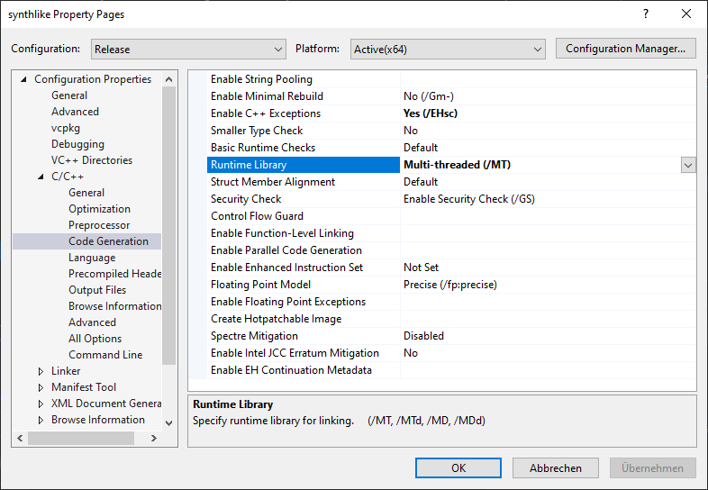

# Building for Windows
(Complete all steps from the [README](README.md) before)

## 1. Generating the `.sln`

### 1.1
Start `cmake-gui` and for both the source code and build dir select the path to this repository.

### 1.2
Add two cache entries
  - **CMAKE_TOOLCHAIN_FILE** : The path to your `vcpkg.cmake` from the previous step.
  - **VCPKG_TARGET_TRIPLET** : The triplet you used when installing the dependencies, probably `x64-windows-static`

  
Screenshot

  
  
  

  
### 1.3
Click `Configure`, select _Visual Studio 16 2019_ as generator, input your platform (in this case _x64_) and press `Finish`

  
Screenshot

  
  
  

### 1.4
Since use static linking for our libraries, we need to fix the entries with names `CMAKE_CXX_FLAGS_DEBUG`,
`_RELEASE` etc. and replace the `/MD` inside their value with `/MT`. (likewise with `/MDd`).

  
Screenshot

  
  
  

### 1.5
Press `Configure` again, all entries should lose their red background.

  
Screenshot

  
  
  

### 1.6
Now press generate and click on `Open Project`, Visual Studio should open the Solution.  

  
Screenshot

  
  
  

## 2. Building the project

### 2.1
Go to `Project > Properties > C/C++ > Code Generation`, select your desired configuration (f.ex. `Release`)
in the top-left dropdown and set the value of `Runtime Library` to ´Multi-threaded (/MT)´ (or the _/MTd Debug_ version)

  
Screenshot

  
  
  

## 2.2
Now go to `Build > Build solution`. Once the build completes successfully, you should find a file `synthlike.exe`
in the projects `bin/`-folder. Copy the folder `res/` from the projects root directory next to the executable and
the program should run.
